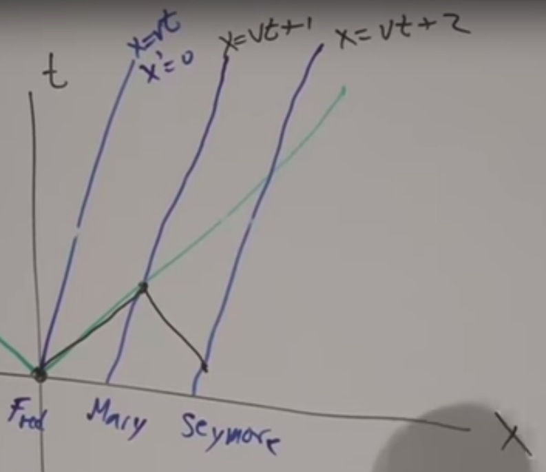
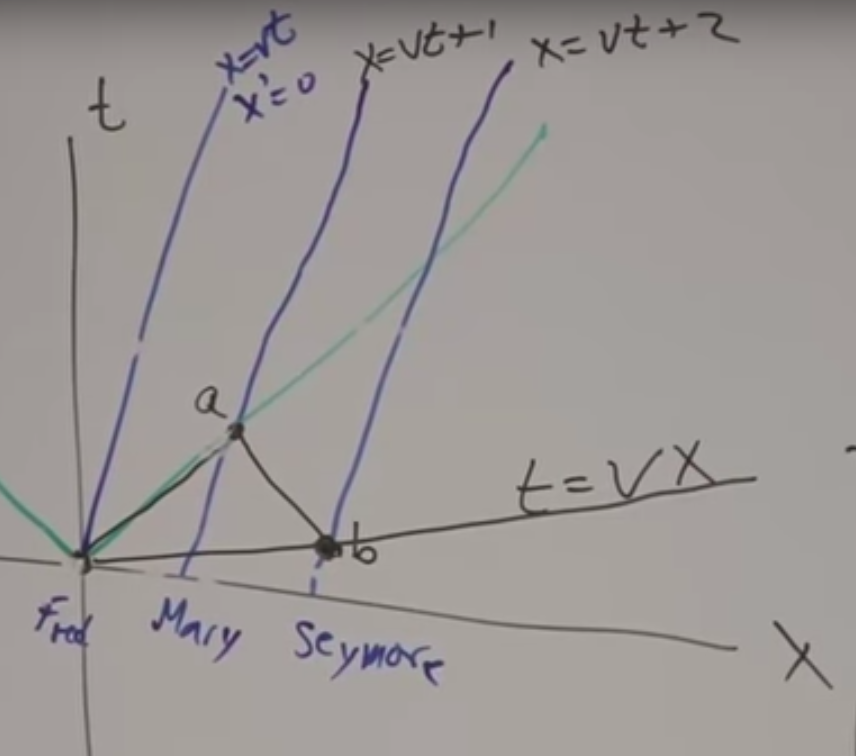
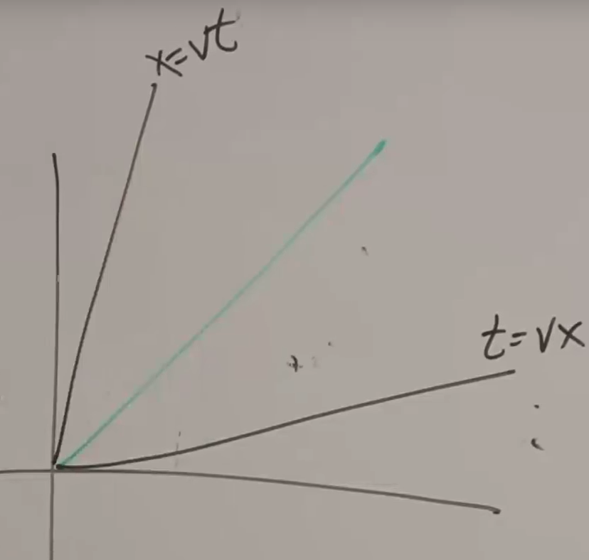

# Relativity

## Introduction

Suppose there is a frame $X$, in which, as in all other frames, the light travels according to $x=ct$. Suppose there is another frame $X'$, moving relatively according to $x=vt$. The equation of motion of $X'$ in $X'$ is $x'=0$, obviously. The relation between the frames is $x'=x-vt$. 

In Newton’s classical model, the relation in time is $x=x'$. The light moves in $X'$ according to $x'=(c-v)t=(c-v)t'$. This is wrong. Let’s look at the right things.

Suppose there are 3 persons, moving in the same velocity as $X'$, with certain distances between them. Suppose the 3 persons has distances between them each 1 unit of measurement. The speed of light measures 1 unit in the coordinate system, so that the equation of motion of light is $x=t$ and the $v$s of the persons are actually a ratio to the light speed.
$$
x=vt,x=vt+1,x=vt+2
$$
Suppose for the first person, time 0 is $t=0$ at the origin. At time 0, the first person sends out a light signal to the second, and the third person also sends a light signal to the second such that the signal arrives at the same time as the first’s. The time when the third person sends the light signal, is the time 0 of the third person.

Compute the coordinate of the third person sending signal:
$$
t_b=\frac{2v}{1-v^2},x_b=\frac{2}{1-v^2}
$$
Obviously, the slope of the line crossing through the origin and time 0 of the third person is $v$.

Remember still that $v$ is a ratio.

Hence, the 2 symmetric line exist in the graph.

The relation of time among frames moving in the same velocity is clear.

For the moving frame $X'$, the equation of motion is $x'=x-vt$ under the classic model. Under the real case of relativity, the equation maybe a little wrong by a factor related to speed.
$$
x'=(x-vt)f(v)
$$
Same thing holds for time:
$$
t'=(t-vx)g(v)
$$
It tells us that when $x=vt$, $x'=0$, when $t=vx$, $t'=0$. This is the statement of Einstein, that the law of physics is the same under the same frame.

Also according to Einstein, the speed of light is the same under any frame, so that when $x=t$, the 2 equation must be the same, e.g., $x'=t'$. Hence:
$$
f(v)=g(v)
$$
The equation of motion should be modified to:
$$
x'=(x-vt)f(v),t'=(t-vx)f(v)
$$
The following is going to find $f(v)$.

Write the functions backward as frame $X$ with respect to frame $X'$, everything is the same except for the direction of velocity:
$$
x=(x'+vt')f(v),t=(t'+vx')f(v)
$$
Combine the 4 equations and solve for $f(v)$:
$$
f(v)=\frac{1}{\sqrt{1-v^2}}
$$
Therefore:
$$
x'=\frac{x-vt}{\sqrt{1-v^2}},t'=\frac{t-vx}{\sqrt{1-v^2}}
$$
Change the equation back to the normal scale, where the speed of light is $c$:
$$
x'=\frac{x-vt}{\sqrt{1-v^2/c^2}},t'=\frac{t-(v/c^2)x}{\sqrt{1-v^2/c^2}}
$$
